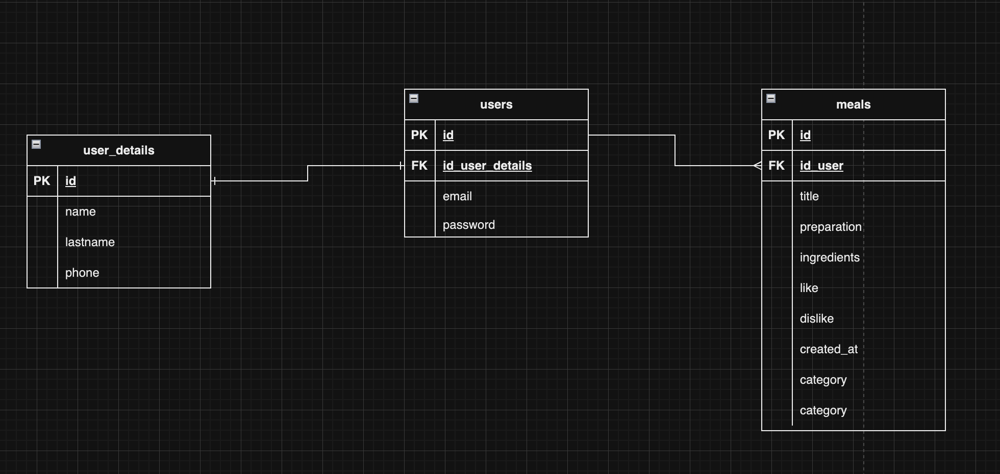

# MealFuel

## Opis

MealFuel to aplikacja webowa dedykowana do przeglądania i udostępniania przepisów kulinarnych. Użytkownicy mogą się zarejestrować, zalogować, dodawać własne przepisy i przeglądać te dodane przez innych.

## Funkcjonalności

- **Rejestracja i Logowanie**: Użytkownicy mogą tworzyć własne konta i logować się.
- **Dodawanie Przepisów**: Zarejestrowani użytkownicy mogą dodawać własne przepisy.
- **Przeglądanie Przepisów**: Wszystkie dodane przepisy są dostępne do przeglądania dla każdego użytkownika.
- **Szukanie po Nazwie**: Użytkownicy mogą przeszukiwać przepisy po nazwie.
- **Filtrowanie po Kategorii**: Możliwość sortowania przepisów według różnych kategorii.

## Instalacja

1. Sklonuj repozytorium:

    ```bash
    git clone git@github.com:AdrianBozecki/wdpai.git
    ```

2. Przejdź do folderu z projektem:

    ```bash
    cd MealFuel
    ```

3. Zainstaluj zależności:

    ```bash
    docker-compose build
    ```

4. Uruchom projekt:

    ```bash
    docker-compose up
    ```

## Jak korzystać

- Otwórz stronę główną.
- Zaloguj się lub zarejestruj.
- Przeglądaj dostępne przepisy lub dodaj własny.

## Technologie

- PHP
- JavaScript
- HTML
- CSS
- Docker
- Git
- Postgres

## Autor

Adrian Bożęcki

## Schemat Bazy danych

